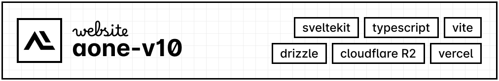

## 📄 about

this is like, the result of when I lock in for real and decide I need to finish my website once and for all. **none of my work here was made with AI, including this README.**

## 🌠 highlights

- ✏️ a bunch of colored text
- 🎨 nice theme palette generation with CSS
- 💡 which also means light & dark mode support
- 🖥️ activity widgets that show up on the homepage pretty neatly
- 📰 blog posts like any other version of this
- 🏆 project showcase that's not hardcoded
- 👥 friends section that _is_ hardcoded
- 🎀 non-binary

## 📦 stuff used

- ⚙️ typescript, my beloved
- 🌩️ sveltekit + vite, they're awesome
- 📂 cloudflare r2, for file storage
- 💾 drizzle, for database management
- 🌐 vercel, for site hosting

### [check it out!](https://auti.one/)
